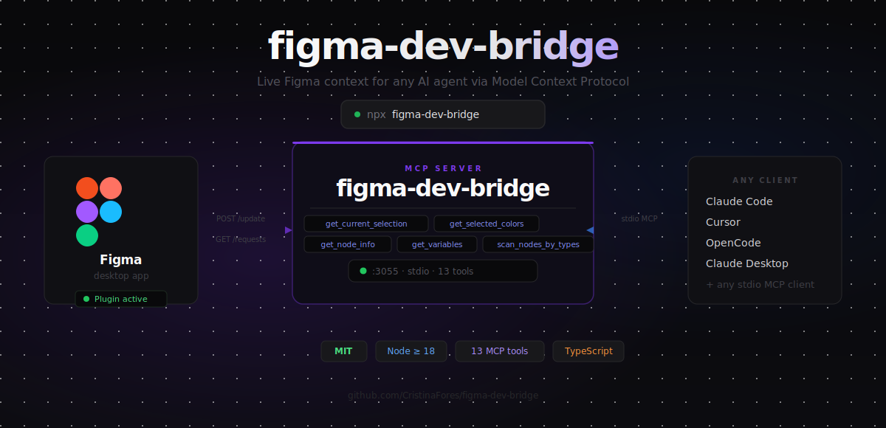

# figma-dev-bridge

<p align="center">
  
</p>

A **client-agnostic [MCP](https://modelcontextprotocol.io) server** that gives any AI agent live access to your Figma design context: the current selection, colors, text, spacing tokens, variables, prototype interactions — and on-demand navigation of the **entire document** by node id.

It is **not** tied to any single client. It works with Claude Code, Cursor, OpenCode, Claude Desktop, or anything that speaks the Model Context Protocol over stdio.

> Why this exists: most "see my Figma" setups only expose what's selected, and choke when you ask for a whole large file. This server streams selection context continuously **and** lets the agent walk the document lazily (node by node) so it never has to serialize a huge tree at once.

---

## How it works

```
┌──────────────┐   stdio    ┌─────────────────────┐   HTTP :3055   ┌──────────────┐
│  AI client   │ ◀───────▶  │  MCP server         │ ◀───────────▶  │ Figma plugin │
│ (Claude Code,│   tools    │  (this package)     │  push + poll   │ (in Figma)   │
│  Cursor, …)  │            │  + local bridge     │                │              │
└──────────────┘            └─────────────────────┘                └──────────────┘
```

1. The **Figma plugin** runs inside Figma. It continuously **pushes** the current selection/context to a local bridge (HTTP `POST /update`), and **polls** that bridge for on-demand requests (`GET /requests`), answering them live (`POST /response`).
2. The **MCP server** exposes tools to the AI client over stdio. Read tools serve the last pushed context; on-demand tools enqueue a request and wait for the plugin's reply.
3. State is shared through small JSON files in the OS temp dir, so the bridge and the MCP server stay in sync even across processes.

---

## Requirements

- **Node.js >= 18**
- The **Figma desktop app** (plugins in development run there)
- An MCP-compatible AI client

---

## Installation

### Option A — npx (recommended)

No install needed:

```bash
npx figma-dev-bridge
```

Configure your client to run `npx -y figma-dev-bridge` as the command (see [`client-config-examples/`](client-config-examples)).

### Option B — from source

```bash
git clone https://github.com/CristinaFores/figma-dev-bridge.git
cd figma-dev-bridge
npm install
npm run build:all        # builds the MCP server and the plugin
```

Your server entry point is then `dist/index.js`.

---

## 1. Configure your AI client

Ready-to-copy snippets live in [`client-config-examples/`](client-config-examples). Point your client at the server:

**Claude Code / Cursor / Claude Desktop** (`mcpServers` format):

```json
{
  "mcpServers": {
    "figma-dev-bridge": {
      "command": "node",
      "type": "stdio"
    }
  }
}
```

**OpenCode** (`~/.config/opencode/opencode.jsonc` — note `type: local` and `command` as an array):

```json
{
  "mcp": {
    "figma-dev-bridge": {
      "type": "local",
      "enabled": true
    }
  }
}
```

Once published to npm, replace the command with `npx figma-dev-bridge` (see the examples folder).

## 2. Install the Figma plugin

1. In Figma: **Menu → Plugins → Development → Import plugin from manifest…**
2. Select **`figma-plugin/manifest.json`** from this repo.
3. Run it: **Plugins → Development → Figma Dev Bridge**.

The plugin window shows a status dot:

- 🟢 **Conectado al bridge** — everything is wired up.
- 🔴 **Sin bridge** — the MCP server isn't running (start your AI client, or run `npm start`).

> The plugin must stay open in Figma for the tools to work. Selection tools serve the last cached data; on-demand tools require the plugin to be live.

---

## Two ways to read your design

### Mode 1 — Select in Figma, ask the AI

Select any frame, component, or layer in Figma. The plugin pushes that context automatically. Then just ask:

```
"What colors does this component use?"
"List all the text nodes in this selection."
"What spacing tokens are applied here?"
```

The AI reads whatever you have selected — no extra arguments needed.

**Tools:** `get_current_selection` · `get_selected_colors` · `get_selected_texts` · `get_selected_spacing` · `get_selected_interactions`

---

### Mode 2 — Navigate by node id (no selection needed)

Every Figma node has an id. Get the ids from the document overview tools, then drill in on-demand — the plugin fetches each node live via `getNodeByIdAsync`, so you never have to load the whole tree at once.

```
# Step 1 — get top-level frame ids for the current page
get_current_page

# Step 2 — drill into a frame
get_node_info { id: "123:456", depth: 2 }

# Step 3 — keep going, lazily
get_node_info { id: "123:789", depth: 1 }

# Or jump straight to what you need
scan_nodes_by_types { types: ["INSTANCE"] }   → find all component instances
get_node_info { id: "..." }                   → inspect one
```

The plugin must be **open and connected** (green dot) for on-demand tools to respond.

**Tools:** `get_current_page` · `get_all_pages` · `get_frame_by_name` · `get_node_info` · `get_nodes_info` · `scan_nodes_by_types` · `get_variables` · `get_component_definitions`

---

## Tools

13 tools, grouped by what they read.

### Selection-based (serve the live selection)

| Tool | Figma API | Returns |
| --- | --- | --- |
| `get_current_selection` | `figma.currentPage.selection` | Selected nodes with fills, position, size, text |
| `get_selected_colors` | `node.fills` (SOLID) | Unique hex colors used in the selection + descendants |
| `get_selected_texts` | TEXT nodes | Text content, font family, font size |
| `get_selected_spacing` | auto-layout + `boundVariables` | itemSpacing/padding **and the bound spacing-token name** (local or library) |
| `get_selected_interactions` | `node.reactions` | Prototype animations: trigger, action, transition type, duration, easing |

### Document overview

| Tool | Figma API | Returns |
| --- | --- | --- |
| `get_current_page` | `figma.currentPage.children` | Top-level frames of the current page (with ids) |
| `get_all_pages` | `figma.root.children` | All pages in the document |
| `get_frame_by_name` | name search | A frame/layer by name (case-insensitive) |
| `get_component_definitions` | COMPONENT / COMPONENT_SET | Components on the current page |
| `get_variables` | `figma.variables.getLocalVariablesAsync()` | All local design tokens (color, FLOAT/spacing, string, boolean) by collection and mode. Filter with `{ type }` |

### On-demand navigation (walk the whole document, lazily)

| Tool | Figma API | Returns |
| --- | --- | --- |
| `get_node_info` | `figma.getNodeByIdAsync(id)` | Any node by id + children to a given `depth` |
| `get_nodes_info` | many `getNodeByIdAsync` | Several nodes by id in one call |
| `scan_nodes_by_types` | tree walk | Every node matching `types` (e.g. `["TEXT","INSTANCE"]`), capped at 1000 |

### REST API — by URL (no plugin needed)

Requires `FIGMA_ACCESS_TOKEN` in your environment.

| Tool | Returns |
| --- | --- |
| `get_file_from_url` | Pages, top-level frames, and metadata from any Figma URL |
| `get_node_from_url` | A specific node from a URL that includes `?node-id=X-Y` |

### Typical workflow

```
get_all_pages                       → page ids
get_current_page                    → top-level frame ids
get_node_info { id, depth: 2 }      → drill into a frame
get_node_info { id: <child>, ... }  → keep drilling, lazily
```

or jump straight to what you need:

```
scan_nodes_by_types { types: ["INSTANCE"] }   → find them
get_node_info { id }                           → inspect one
```

---

## Configuration

| Env var | Default | Notes |
| --- | --- | --- |
| `FIGMA_BRIDGE_PORT` | `3055` | Port for the local bridge. **If you change it, you must also change the port hard-coded in `figma-plugin/code.ts`** and rebuild the plugin, since the plugin can't read env vars. |
| `FIGMA_ACCESS_TOKEN` | — | Personal access token from Figma → Settings → Security → Access tokens. Required only for the URL-based tools (`get_file_from_url`, `get_node_from_url`). |

---

## Development

```bash
npm run build         # compile the MCP server (src → dist)
npm run build:plugin  # compile the Figma plugin (figma-plugin/code.ts → code.js)
npm run build:all     # both
npm run watch:plugin  # recompile the plugin on save
npm run dev           # run the server with tsx (no build)
npm run lint          # eslint (typed)
npm test              # build + node:test suite
```

Architecture:

```
src/
  index.ts                 entry: starts MCP stdio server + local bridge
  core/types.ts            shared types (the context payload shape)
  figma-bridge/
    ws-server.ts           HTTP bridge (push + on-demand request/response)
    store.ts               file-based shared state + requestFromPlugin()
  mcp-server/
    tool-registry.ts       registers all tools
    tools/*.ts             one file per tool
figma-plugin/
  code.ts                  plugin main thread (push + poll loop)
  ui.html                  status UI
  manifest.json            plugin manifest (import this into Figma)
```

---

## Troubleshooting

**Plugin stuck on "Iniciando…" / 🔴 "Sin bridge"**
The MCP server isn't running. Start your AI client (which spawns it), or run `npm start`. Verify with:
```bash
curl -X POST http://localhost:3055/update -H "Content-Type: application/json" -d '{}'
# → {"ok":true}
```

**Tools return "invalid result" or "Cannot read … of undefined"**
Old data from a previous version. Reconnect the MCP server in your client and reload the plugin (the document-level data is sent once on first connect).

**On-demand tools (`get_node_info`, …) time out**
The plugin must be **open** in Figma — it answers those requests by polling. Reopen it and check for the green dot.

**Changed the port and it broke**
The plugin's port is compiled in. Update `figma-plugin/code.ts`, run `npm run build:plugin`, re-import the plugin.

**`networkAccess` / localhost errors when importing the plugin**
The manifest allows `http://localhost` and uses `devAllowedDomains: ["*"]` for development. Re-import the manifest after any change so Figma re-reads network permissions.

---

## License

[MIT](LICENSE) © Cristina Fores Campos
